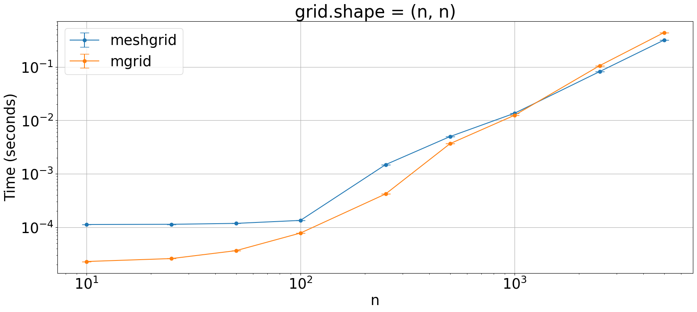

## Generating a uniform 2D grid

Which is the fastest way to generate a uniform 2D grid?


```python
import numpy as np
from plot_machinery.plot import data, kernel, plot, repeat_count, clear_kernels
```


```python
clear_kernels()


@kernel()
def meshgrid(N):
    x = np.linspace(-5, 5, N)
    y = np.linspace(-5, 5, N)
    xx, yy = np.meshgrid(x, y)
    return np.dstack(np.meshgrid(x, y))


@kernel()
def mgrid(N):
    step = 10 / (N - 1)
    return (np.mgrid[:N, :N] * step - 5).T


@data(steps=[10, 25, 50, 100, 250, 500, 1000, 2500, 5000])
def data_gen(step):
    return (step,)


@repeat_count
def repcnt(step):
    if step < 1000:
        return 1000
    if step < 2500:
        return 100
    return 10
```


```python
plot(logx=True, logy=True, xlabel="n", title="grid.shape = (n, n)")
```


    

    

