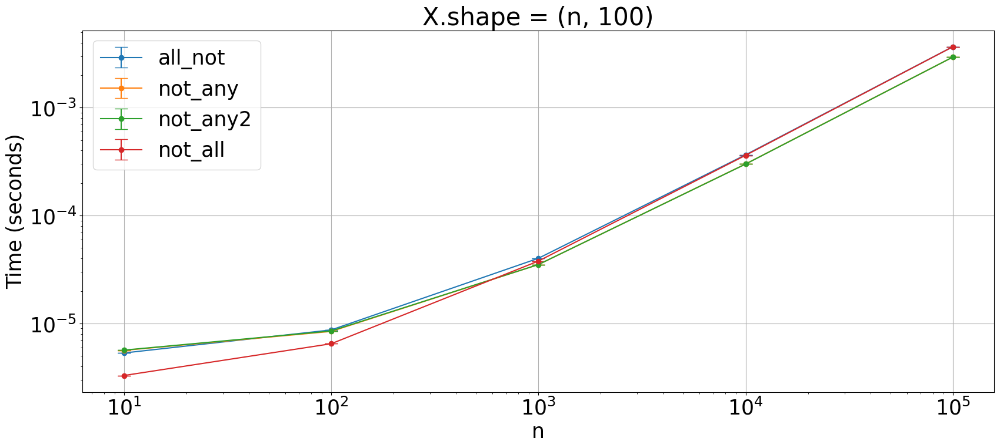

## `all_false`

Which is the fastest way to achieve something like `np.all_false`?


```python
import numpy as np

from plot_machinery.plot import data, kernel, plot, repeat_count
```


```python
@kernel()
def all_not(x):
    return np.all(np.logical_not(x), axis=1)


@kernel()
def not_any(x):
    return np.logical_not(np.any(x, axis=1))


@kernel()
def not_any2(x):
    return ~np.any(x, axis=1)


@kernel()
def not_all(x):
    return (~x).all(axis=1)


@data(steps=[10, 100, 1000, 10000, 100000])
def data_gen(step):
    x = np.full((step, 100), False)
    x[2, 5] = True
    x[step // 2, 99] = True
    return (x,)
```


```python
plot(logx=True, logy=True, xlabel="n", title="X.shape = (n, 100)")
```


    

    

