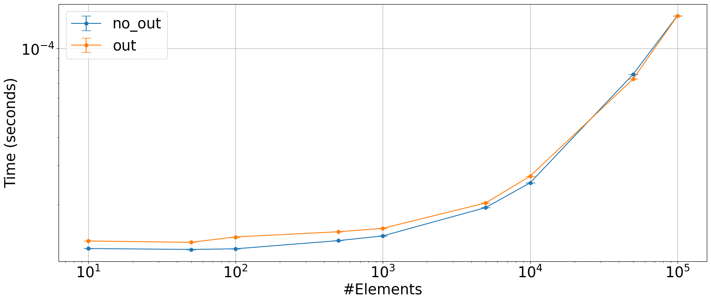

## `out` parameter

Does using the `out` parameter bring any improvement in performance?


```python
import numpy as np
from plot_machinery.plot import data, kernel, plot, repeat_count, clear_kernels
```


```python
clear_kernels()


@kernel()
def no_out(x):
    return np.clip(x, 100, 101)


@kernel()
def out(x):
    np.clip(x, 100, 101, out=x)


@data(steps=[10, 50, 100, 500, 1000, 5000, 10000, 50000, 100000])
def data_gen(step):
    return (np.arange(step).reshape(step // 10, -1),)
```


```python
plot(logx=True, logy=True, xlabel="#Elements")
```


    

    

