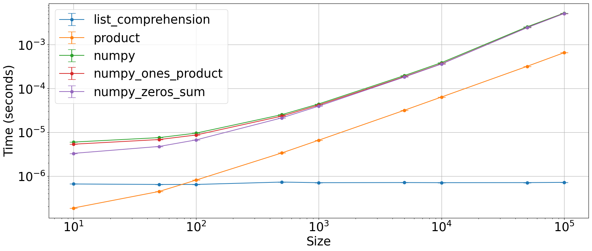
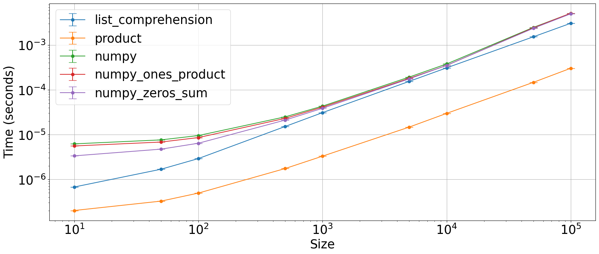

## Constant iterable

Which is the fastest way to generate an iterable (tuple or list) such as `[1 1 1 1 ... 1]`?


```python
import numpy as np
from plot_machinery.plot import data, kernel, plot, repeat_count, clear_kernels
```


```python
@data(steps=[10, 50, 100, 500, 1000, 5000, 10000, 50000, 100000])
def data_gen(step):
    return (step,)
```

### Tuple


```python
clear_kernels()


@kernel()
def list_comprehension(N):
    return (2 for _ in range(N))


@kernel()
def product(N):
    return (2,) * N


@kernel()
def numpy(N):
    return tuple(np.repeat((2,), repeats=N))


@kernel()
def numpy_ones_product(N):
    return tuple(np.ones(N, dtype=int) * 2)


@kernel()
def numpy_zeros_sum(N):
    return tuple(np.zeros(N, dtype=int) + 2)


plot(logx=True, logy=True, xlabel="Size")
```


    

    


### List


```python
clear_kernels()


@kernel()
def list_comprehension(N):
    return [2 for _ in range(N)]


@kernel()
def product(N):
    return [
        2,
    ] * N


@kernel()
def numpy(N):
    return list(np.repeat((2,), repeats=N))


@kernel()
def numpy_ones_product(N):
    return list(np.ones(N, dtype=int) * 2)


@kernel()
def numpy_zeros_sum(N):
    return list(np.zeros(N, dtype=int) + 2)


plot(logx=True, logy=True, xlabel="Size")
```


    

    

