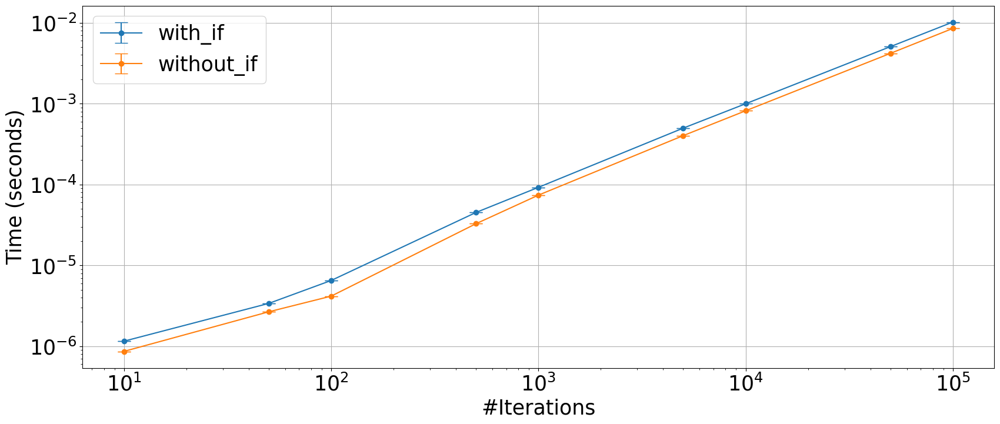

## If in loop construct

What is the weight of an `if` inside a loop in Python?


```python
from plot_machinery.plot import data, kernel, plot, repeat_count
```


```python
@kernel()
def with_if(N):
    for i in range(N):
        if i == -1:
            print("this will never happen")
        x = i * 2 - 1


@kernel()
def without_if(N):
    for i in range(N):
        x = i * 2 - 1


@data(steps=[10, 50, 100, 500, 1000, 5000, 10000, 50000, 100000])
def data_gen(step):
    return (step,)
```


```python
plot(logx=True, logy=True, xlabel="#Iterations")
```


    

    

